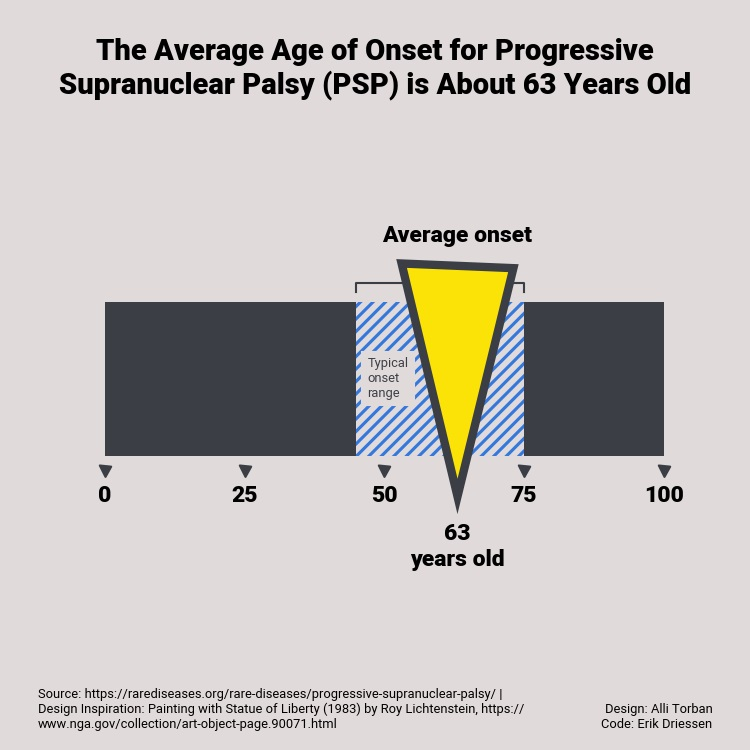

# Matplotlib Playground: recreating data visualizations with python

Collection of jupyter notebooks that explain how to make or recreate creative data visualizations with python and matplotlib. 

The collection currently includes:

- Alli Torban - Single Bar Chart Data Visualization
- ... 

You'll find examples of the generated charts below. Notebooks for the visualisation have the same name. 

#### Alli Torban - Single Bar Chart Data Visualization

Companion blog post can be read [here](https://www.edriessen.com/2024/04/22/recreating-an-alli-torban-visualisation-with-python-and-matplotlib/).

## About

This repo is an idea/work in progress. There will be sporadic updates with notebooks that explain how to make/recreate data visualizations with python and matplotlib. The included visualizations are based on my personal preference. 

Questions or a data visualization suggestion? Contact me [here](https://www.edriessen.com/contact). 
